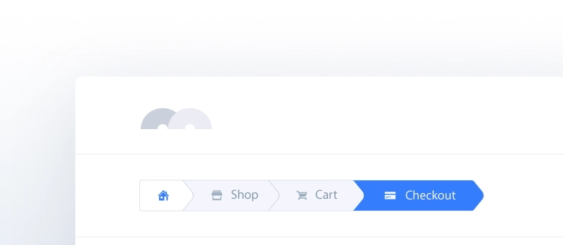

**User interface (UI) элементы** — это части, которые дизайнеры используют для создания приложений или веб-сайтов. Они добавляют интерактивность в пользовательский интерфейс, предоставляя пользователю точки соприкосновения при навигации по ним. Кнопки, полосы прокрутки, пункты меню и чекбоксы.

### Хлебные крошки (Breadcrumb)

Хлебные крошки (навигационная цепочка, англ. Breadcrumbs) – это элемент навигации по сайту, который представляет собой путь от корня сайта, до текущей страницы, на которой в настоящий момент находится пользователь. Хлебные крошки обычно представляют собой полосу в верхней части страницы, обычно под шапкой сайта.