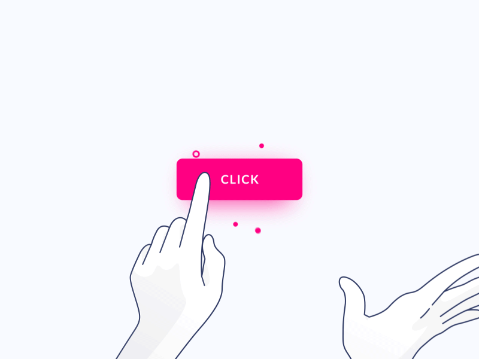
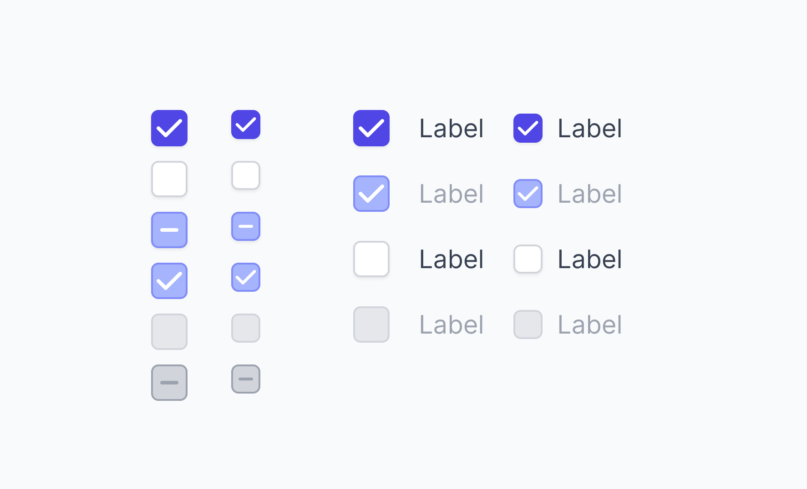
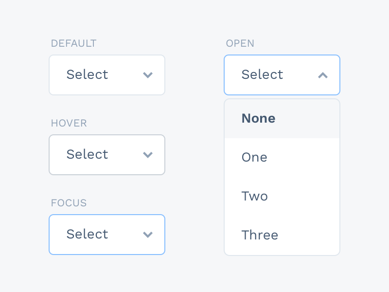

# User interface (UI) элементы

Это части, которые дизайнеры используют для создания приложений или веб-сайтов. Они добавляют интерактивность в интерфейсе, предоставляя пользователю найти точки соприкосновения при навигации по ним: кнопки, полосы прокрутки, пункты меню и чекбоксы.

### Хлебные крошки (Breadcrumb)

Хлебные крошки (навигационная цепочка, англ. Breadcrumbs) – это элемент навигации по сайту, который представляет собой путь от корня сайта, до текущей страницы, на которой в настоящий момент находится пользователь. Хлебные крошки обычно представляют собой полосу в верхней части страницы, обычно под шапкой сайта.

### Button menu

**Bento Menu, Döner Menu, Hamburger Menu, Kebab Menu, Alt-burger, meatball.** Типы иконок меню, которые названы в честь блюд. Используются очень часто в качестве отображения меню.

### Кнопка (Button)

Кнопки позволяют пользователю взаимодействовать с формами на сайте.

### Карточка (Card)

Карточки на данный момент довольно популярны среди UI/UX. Карточки – это небольшие прямоугольные или квадратные модули, которые содержат различную информацию - в виде кнопок, текста, мультимедиа и т.д. Карточки - отличный выбор дизайна пользовательского интерфейса, если вы хотите разумно использовать доступное пространство и предоставить пользователю несколько вариантов содержимого, не заставляя их прокручивать традиционный список.

### Карусель (Carousel)

Карусели позволяют пользователям просматривать наборы контента, такие как изображения или открытки, часто гиперссылки на большее количество контента или источников. Самым большим преимуществом использования карусели в дизайне UI является то, что они позволяют нескольким фрагментам контента занимать одну и ту же область пространства на странице или экране. 

### Чекбокс (Checkbox)

Флаг, который позволяет сделать отбор определённых свойств элемента (например, при выборе параметров товара). 

### Выпадающий список (Dropdown)

Элемент (виджет) графического интерфейса пользователя, позволяющий выбрать одно из нескольких заранее определённых значений параметра. Когда виджет выпадающего списка неактивен, отображается только выбранное значение, а рядом с ним — значок выпадающего списка (по традиции — треугольник или стрелка углом вниз). 

При нажатии на него список раскрывается, отображая все возможные значения, а если они не помещаются в отведённой области — используется полоса прокрутки. После выбора список возможных значений исчезает.

### Форма (Form)

Набор заданных полей для сбора информации пользователя, с целью отправки данных на сервер для дальнейшей обработки (например, использование формы в качестве заказа услуг).

### Поле ввода (Input Field)

Элемент формы, содержащий текстовую информацию. Каждое поле используется для конкретного типа информации: имя, адрес, почта и т.д.

### Загрузка (Loader)

Loader'ы могут принимать самые разные формы. Дизайнеры любят с ними экспериментировать. Loader'ы предназначены для отображения индикатора загрузки, пока на фоне отрабатывает какой-то экшн.

### Модальное окно (popup)

Блок, содержащий контент или сообщение, которое требует от вас взаимодействия с ним, прежде чем вы сможете закрыть его и вернуться к основному контенту.

### Пагинация (Pagination)

Элемент, обычно находящийся в нижней части страницы. Пагинация помогает легко "браузить" страницы сайта, находя нужную вам страницу.

### Radio Buttons

Radio Buttons похожи на чекбоксы, но отличаются тем, что можно выбрать только один из нескольких вариантов.

### Поле поиска (Search Field)

Текстовое поле, предназначенное для поиска информации на сайте или в его разделе.

### Боковая панель (Sidebar)

Графический элемент управления, который отображает различные формы информации справа или слева от окна приложения или операционной системы. 

### Ползунок (Slider Controls)

Элемент управления, который позволяет пользователям выбирать определенное значение (или диапазон значений).

### Тэг (Tag)

Метки, которые помогают маркировать и классифицировать контент. Обычно они состоят из релевантных ключевых слов, которые облегчают поиск и просмотр соответствующего фрагмента контента. Тэги часто используются на социальных сайтах и в блогах.

### Панель вкладок (Tab Bar)

Панели вкладок отображаются в нижней части мобильного приложения и позволяют пользователям быстро перемещаться между основными разделами приложения.

### Подсказка (Tooltip)

Небольшие подсказки, которые помогают пользователям понять предназначение элемента или процесс в интерфейсе.

### Переключать (Toggle)

Графический элемент управления, который позволяет пользователю выбрать один из предопределенного набора параметров (например, переключение темной\светлой темы)