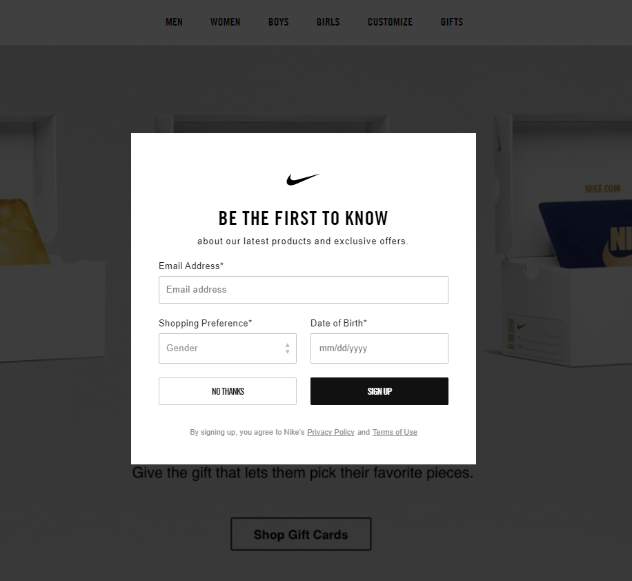

# **User interface (UI) элементы**

Это части, которые дизайнеры используют для создания приложений или веб-сайтов. Они добавляют интерактивность в пользовательский интерфейс, предоставляя пользователю точки соприкосновения при навигации по ним. Кнопки, полосы прокрутки, пункты меню и чекбоксы.

### Хлебные крошки (Breadcrumb)

Хлебные крошки (навигационная цепочка, англ. Breadcrumbs) – это элемент навигации по сайту, который представляет собой путь от корня сайта, до текущей страницы, на которой в настоящий момент находится пользователь. Хлебные крошки обычно представляют собой полосу в верхней части страницы, обычно под шапкой сайта.

### Bento Menu, Döner Menu, Hamburger Menu, Kebab Menu, Alt-burger, meatball

Типы иконок меню, которые названы в честь блюд. Используются очень часто в качестве отображения меню.

### Кнопка (Button)

Кнопки позволяют пользователю взаимодействовать с формами на сайте.

### Карточка (Card)

Карточки на данный момент довольно популярны среди UI/UX. Карточки – это небольшие прямоугольные или квадратные модули, которые содержат различную информацию - в виде кнопок, текста, мультимедиа и т.д. Карточки - отличный выбор дизайна пользовательского интерфейса, если вы хотите разумно использовать доступное пространство и предоставить пользователю несколько вариантов содержимого, не заставляя их прокручивать традиционный список.

### Карусель (Carousel)

Карусели позволяют пользователям просматривать наборы контента, такие как изображения или открытки, часто гиперссылки на большее количество контента или источников. Самым большим преимуществом использования каруселей в дизайне UI является то, что они позволяют нескольким фрагментам контента занимать одну и ту же область пространства на странице или экране. 

### Checkbox

Чекбокс это флаг который позволяет выбрать учитывать этот элемент или нет (например при выборе параметров товара).

### Выпадающий список (Dropdown)

Элемент (виджет) графического интерфейса пользователя, позволяющий выбрать одно из нескольких заранее определённых значений параметра. Когда виджет выпадающего списка неактивен, отображается только выбранное значение, а рядом с ним — значок выпадающего списка (по традиции — треугольник или стрелка углом вниз). 

При нажатии на него список раскрывается, отображая все возможные значения, а если они не помещаются в отведённой области — используется полоса прокрутки. После выбора список возможных значений исчезает.

### Форма (Form)

### Поле ввода (Input Field)

### Loader

Loader'ы могут принимать самые разные формы. Дизайнеры любят с ними экспериментировать. Loader'ы предназначены для отображения индикатора загрузки, пока на фоне отрабатывает какой-то экшн.

### Модальное окно (popup)

Модальное окно - это блок, содержащий контент или сообщение, которое требует от вас взаимодействия с ним, прежде чем вы сможете закрыть его и вернуться к основному контенту.

### Пагинация (Pagination)

Обычно находящийся в нижней части страницы. Пагинация помогает легко "браузить" страницы сайта находя нужную вам страницу.

### Radio Buttons

Radio Buttons похожи на чекбоксы, но отличаются тем, что можно 1 из нескольких вариантов.

### Поле поиска (Search Field)

### Боковая панель (Sidebar)

### Ползунок (Slider Controls)

### Шаговый компонент (Stepper)

Шаговый компонент отображают прогресс в последовательности логических и пронумерованных шагов. Они также могут использоваться для навигации. Шаговые компоненты могут отображать временное сообщение обратной связи после сохранения шага.

### Тэг (Tag)

В дизайне пользовательского интерфейса теги - это, по сути, метки, которые помогают маркировать и классифицировать контент. Обычно они состоят из релевантных ключевых слов, которые облегчают поиск и просмотр соответствующего фрагмента контента. Тэги часто используются на социальных сайтах и в блогах.

### Панель вкладок (Tab Bar)

Панели вкладок отображаются в нижней части мобильного приложения и позволяют пользователям быстро перемещаться между основными разделами приложения.

### Подсказка (Tooltip)

Tooltip - это небольшие подсказки, которые помогают пользователям понять часть или процесс в интерфейсе.

### Переключать (Toggle)

