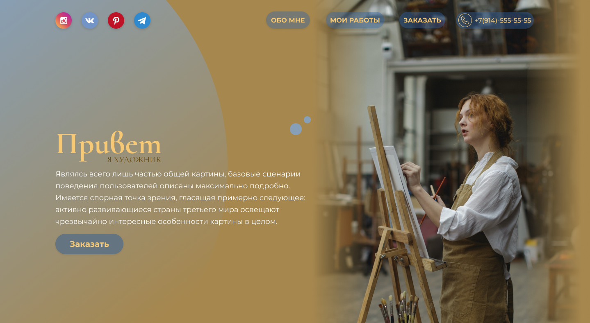
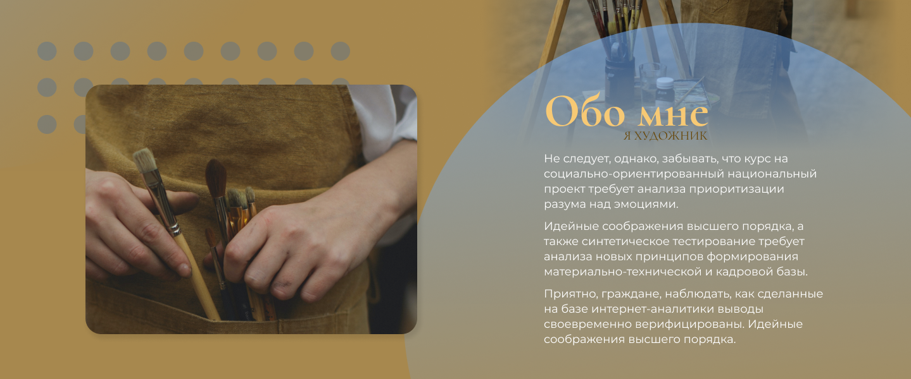
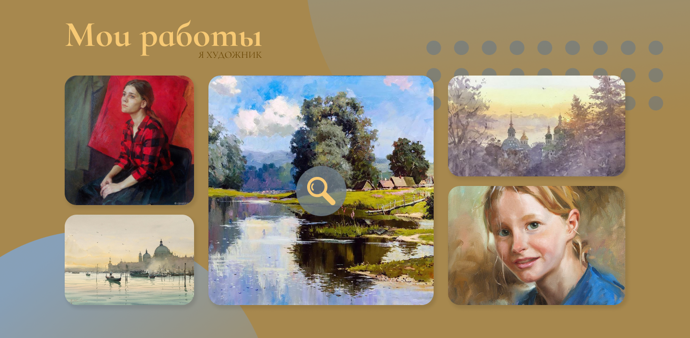
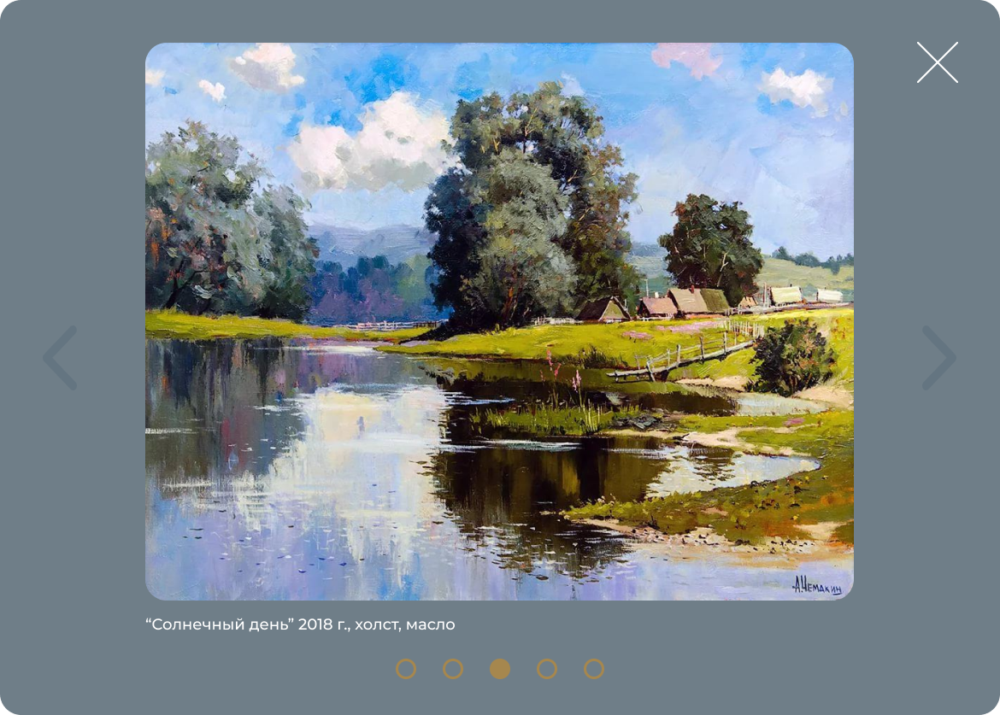
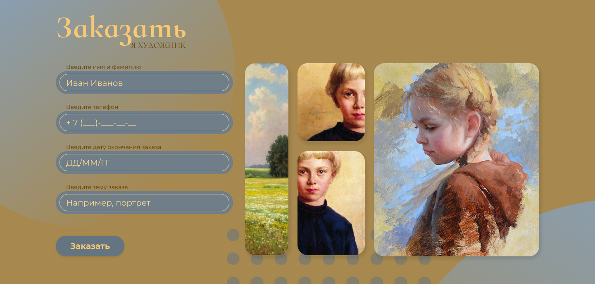
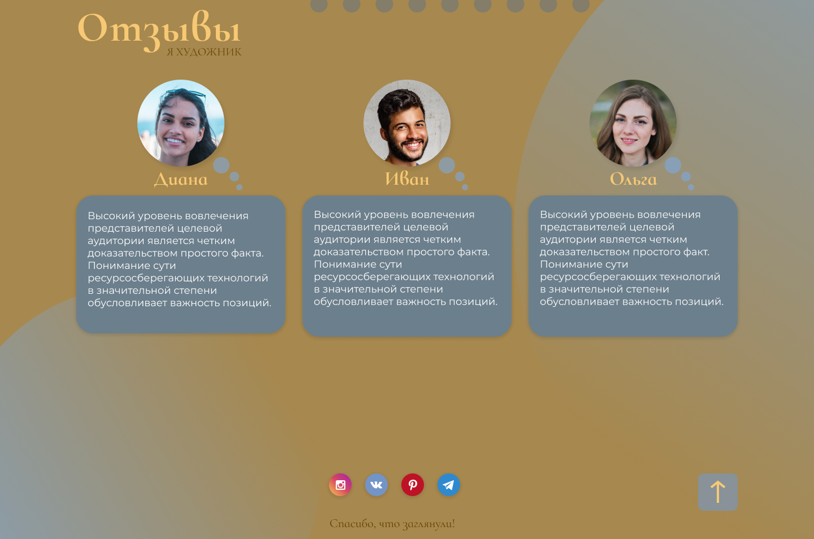

### О работе

Данная работа посвящена сайту художника, он может предлагать свои услуги, показывать готовы картины, собирать новые заявки и отзывы довольных клиентов.

Весь сайт построен по типу лэндинг страницы. Выполнен в минималистичном стиле, использование простых форм для декорирование контента и элементов. Палитра представляет себя подбор основного цвета из заглавной фотографии и гармонирующих с ним остальных цветов.

Разработка сайта представлена в разных адаптивных версиях - desktop, table, mobile.

Работу следует начинать с разработки wareframe (макета). Но так как  изначально я задумывала простую страницу для предоставления услуг художника (фотограф, иллюстратор), то я решила сразу же перейти подбору фотографий и цветовой палитры.

### Разделы

#### "Первый экран"

Первый экран всегда включает в себя элементы меню, оффер (состоящий из заголовка, подзаголовка, основного текста представления и какой-то кнопки). Как расположить данные элементы дизайнер выбирает для себя сам. 

Оффер размешен в левой части экрана и занимает половину контента. С другой стороны расположена фотография, которая с первого взгляда намекает о тематики сайта. Элементы меню расположены в верхней части и представляют собой якоря, ведущие на конкретные разделы страницы, так же в виде иконок присутствуют ссылки на социальные сети и контактная информация.

#### "Обо мне"

В данном разделе текстовое поле включает в себя: заголовок и подзаголовок, выдержанных с определенной стилистике и основной текст. Текст содержит информацию о художнике, его навыках, образование и так далее. 

Для подкрепления текстовой информации присутствует фрагмент фотографии и элемент фигурного декора, стилистически дополняющих этот раздел.

#### "Мои работы"

Данный раздел представляет собой галерею из фотографий работ художника. Каждая картинка является интерактивной, при наведение на нее появляется иконка "лупы", при нажатие на которую открывается модальное окно.

Модальное окно состоит из фотографии, названия, элементов навигации и слайдера. Окно размещается по центру экрана, затемняя весь остальной контент.

#### "Заказать"

Данный раздел включает форму для сбора информации для заказа в левой части экрана. В правой части так же располагается небольшая галерея работ художника. 

#### "Отзывы"

Данный раздел содержит отзывы клиентов. Отзыв состоит из фотографии круглой формы, имени клиента и поля текста.

Футер содержит иконки-ссылки на социальные сети художника, имеется кнопка возврата на первый экран, а также благодарность владельца сайта за его посещение.