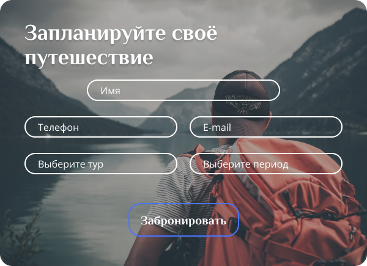

### Wireframe

  

### Главная страница 

#### "Первый экран"

#### "Второй раздел"
Блок с краткой информацией о путешествиях. На главном экране заявлена тема Турции, а здесь представлена схема маршрута путешествия, текстовая информация, небольшое промо видео, и представлены проводники.

#### "Третий раздел"
Блок с информацией о ближайших походах по этому маршруту - расписание.

#### Футер
В футере есть вся необходимая информация для связи. Ссылки на другие страницы. 

#### Форма для заявки 
Всплывающее окно после нажатия кнопки "Забронировать".

### Страница с блогами
На данной страницы есть карточки статей блога, которые работают как ссылка и переходят на страницу статьи.

### Страница статьи

### Адаптив
Также, в Figma есть два адаптивных макета под планшетную и мобильную версию.

### Figma
