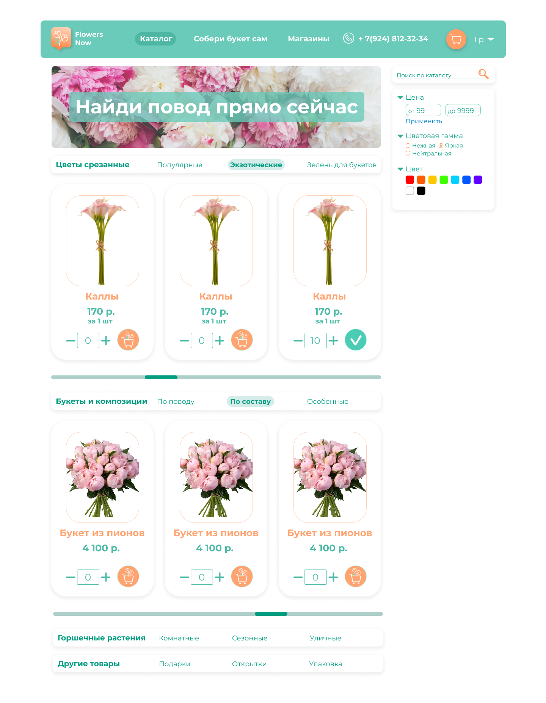
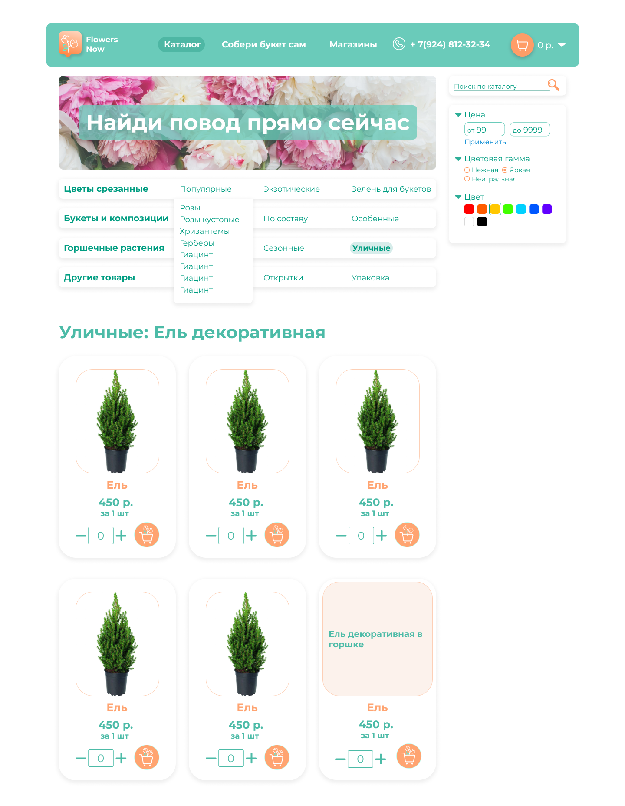
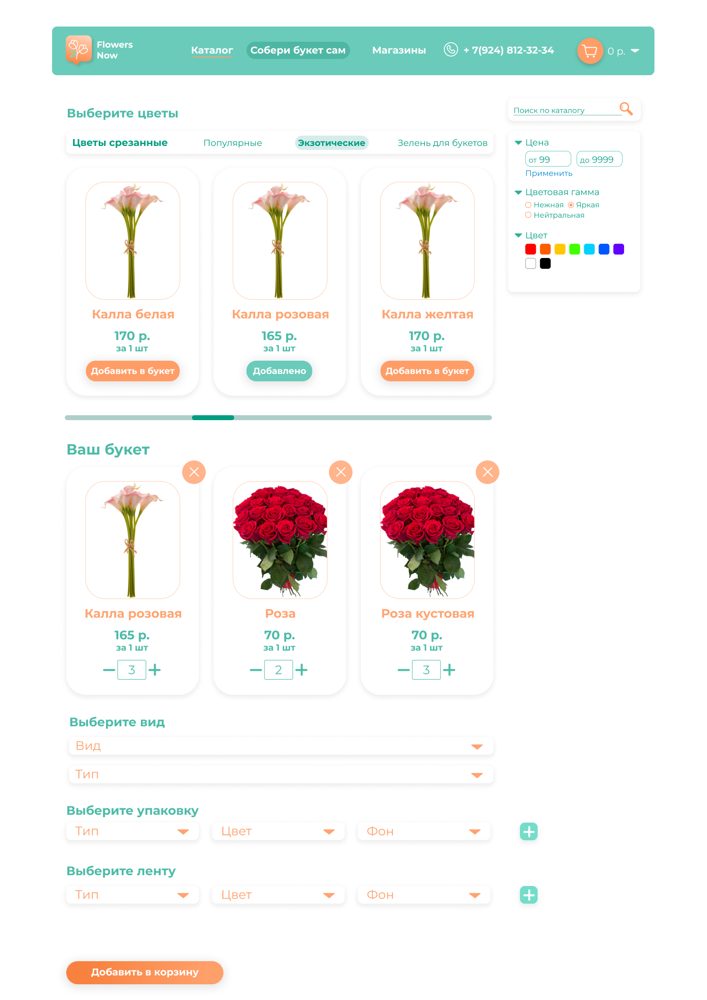
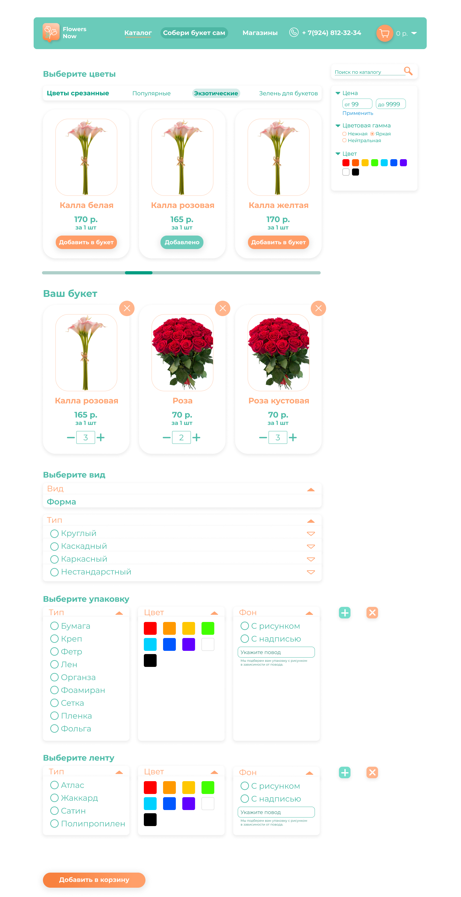
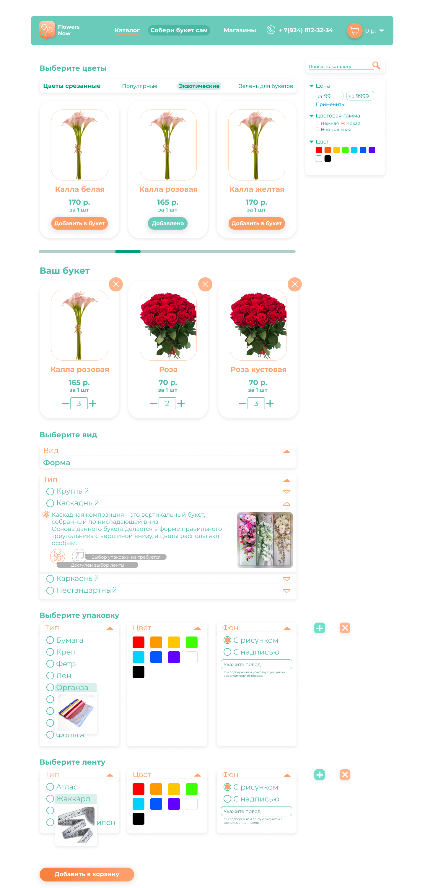
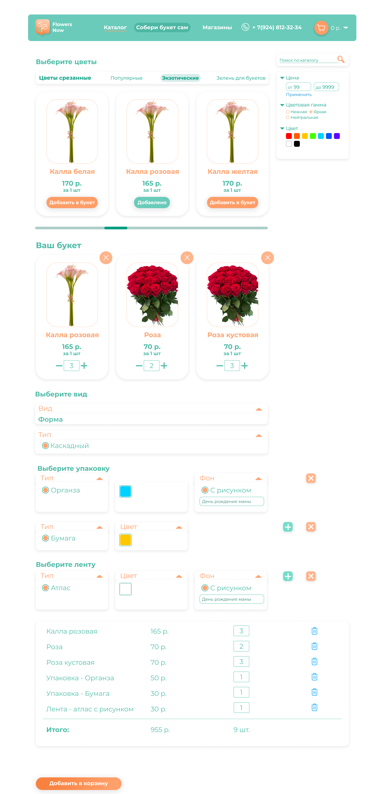
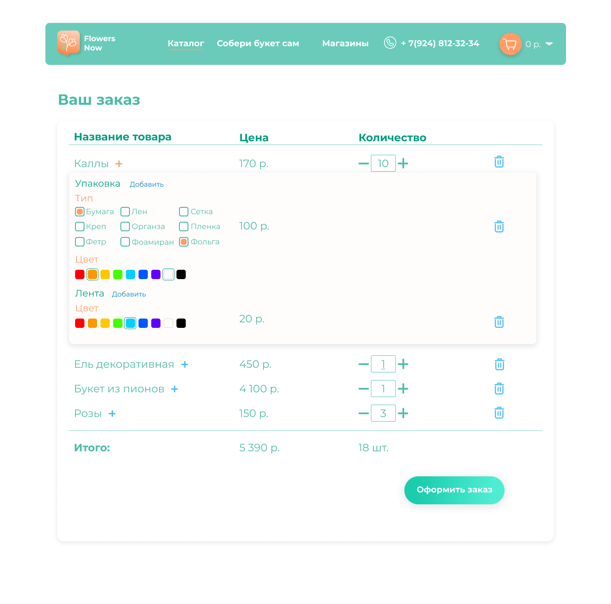
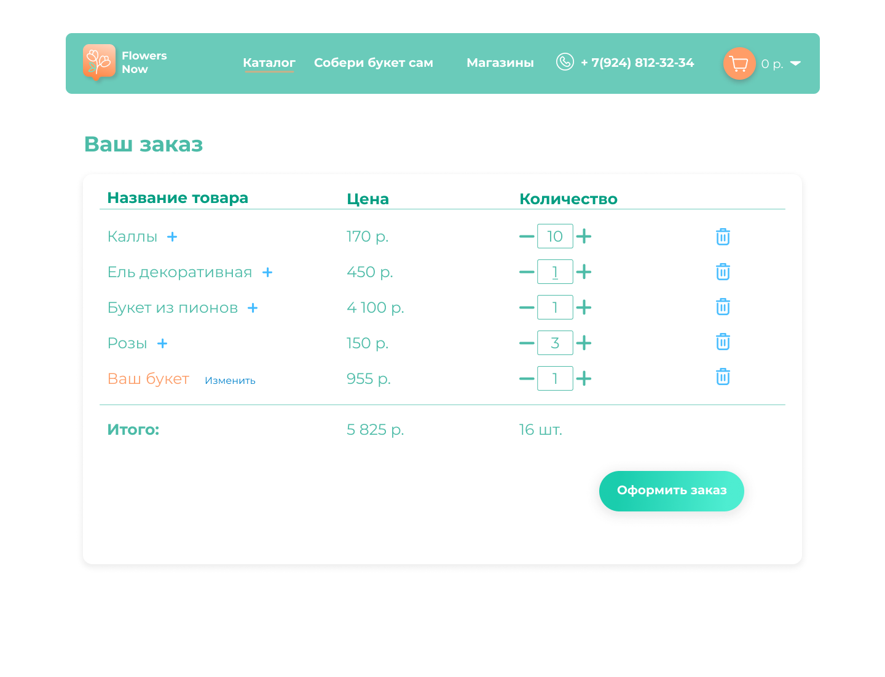

### Лендинг магазина 
Основная визитка сайта это лендинг страницы. Здесь мы видим блоки о магазине, небольшая характеристика, каталог товаров с возможностью добавить в карзину , фото галерея, и возможность оставить заявку на обратную связь.

### Каталог магазина
Сам каталог выполнен в обычном стиле. В нем присуствуют карточки товара. В них входят цветы, букеты, различные подарки и украшения.  
Есть два варианта показ категорий в каталоге. Отличаються они по тому как будут разбиваться карточки товара по разным типам. 
В первом варианте, у нас есть блок с выбором типа товара, при нажатие на него появляеться ряд состоящий их 3 карточек с прокруткой.  
Во втором варианте, все блоки с типами вынесены на вверх. Все карточки стояться в сетку. При выборе категирии, список товара обновляеться

### Конструктор букета
Так же есть универсальный конструктор букета. Где с помощью простого интерьфейса можно самостоятельно выбрать и составить любой сложности букет.  
Функционал конструктора:
 - Выбрать цветы
 - Выбрать вид и  тип букета
 - Цвет и тип упаковки
 - Цвет и тип ленты  

  
 
В типах ленты и упаковки есть небольшие подсказки что бы человек который не разбирается, смог с орентироваться и выбрать то что ему больше понравиться.  
Так же при состовление букета автоматически расчитываеться стоймость, показываеться общее количество позиций и стоймость.

  

### Корзина
В корзине можно увтдеть список всех добавленных позиций. На каждую позицию товара, можно дополнительно выбрать тип и цвет упаковки, и ленты.  
Так же, есть быстрый доступ что бы изменить свой собранный букет. 

  

### Figma

