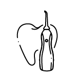

Вакансия на должность "Помощник дизайнера/дизайнер" в небольшую компанию.\
Было 2 задания:

1. Сделать баннер на распродажу всей линейки блендеров нашей компании. Баннер будет находиться на сайте компании.
2. Создать иконку ирригатора, чтобы можно было понять, что и для чего этот инструмент.

Начнем мы с рекламного баннера.

В задании нетприсутсвуеттематики распродажи, а есть только товар. \
Первый вариант, это весенняя распродажа. Цвета выбраны более теплые, подходящие к весеннему настроению. Мы показываем, на какую именно технику идет распродажа, с небольшим пояснительным текстом. Баннер должен быть легким, привлекающий к себе внимание. Чтобы не было слишком скучно, были добавлены некоторые декоративные элементы на задний фон.

Второй вариант более общий, не привязан к чему либо. Также, использовалось небольшое количество цветов. Крупный текс, который можно легко дополнить или изменить. Показан сам товар акции.

Второе задание создание иконки.

Ирригатор - это специальное устройство для гигиены полости рта. Сделаны иконки двух типов: портативный и стационарный. Иконки простые, без сложных элементов. У каждой есть повторяющаяся черта - небольшой штрихпунктирный разрыв. В портативном варианте был добавлен эскиз зуба, чтобы можно было понять примерную тематику прибора.

 