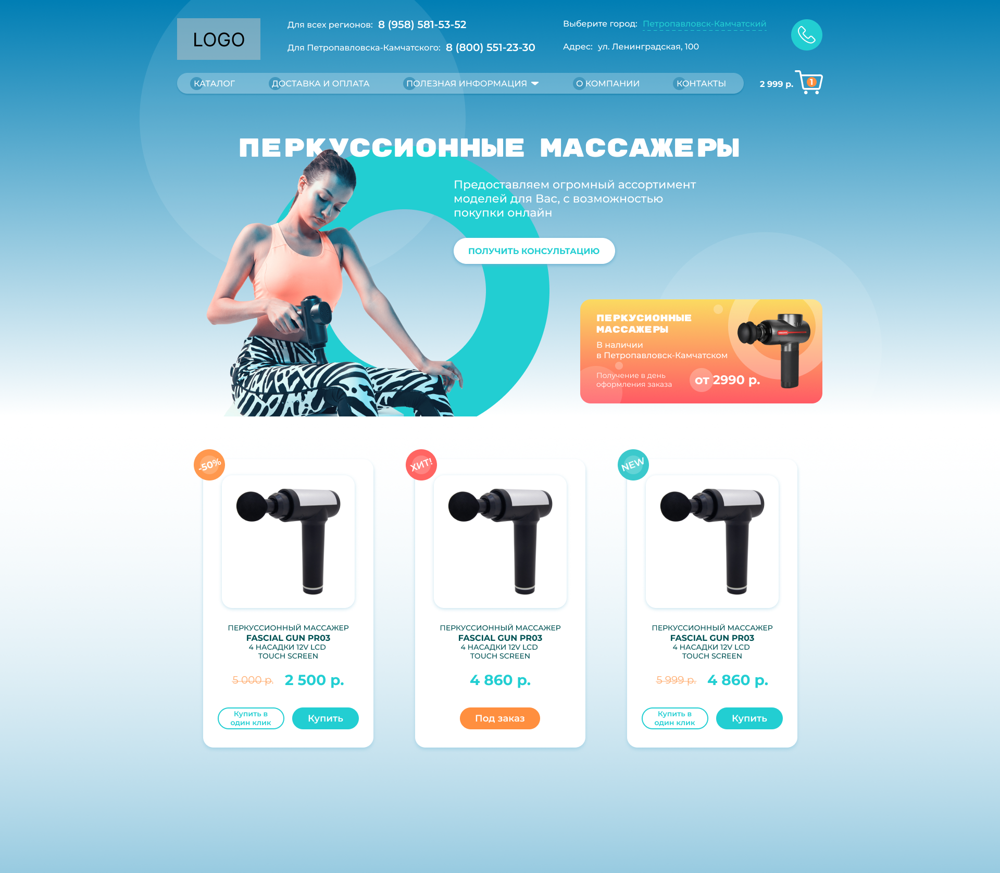
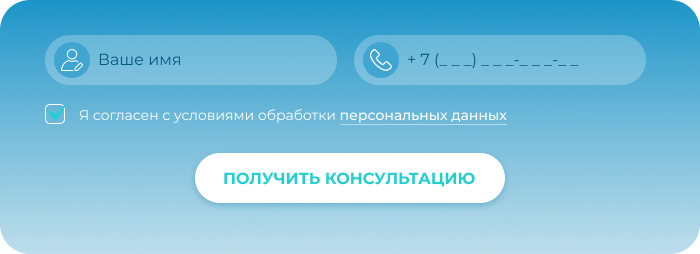

#### Первое тестовое задание 

Нужно было создать макет первого экрана интернет магазина по продаже массажеров.  
Задание состояло из выполнения верхнего и нижнего меню, офферной части, небольшого баннера, редактирование и расположение тематического фото.  
Также, нужно было сделать карточки товара и форму захвата с именем, телефоном и кнопкой.

  

#### Второе тесовое задание 

Было дано задание сделать медийно-контекстный баннер (3 любых формата) для посадочной, например для компании, которая организует праздники для животных.
  
 
