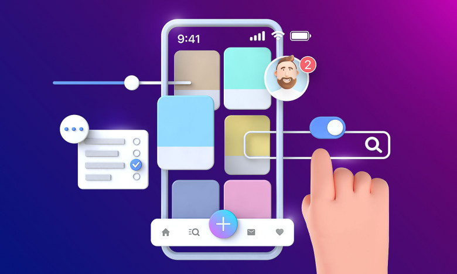
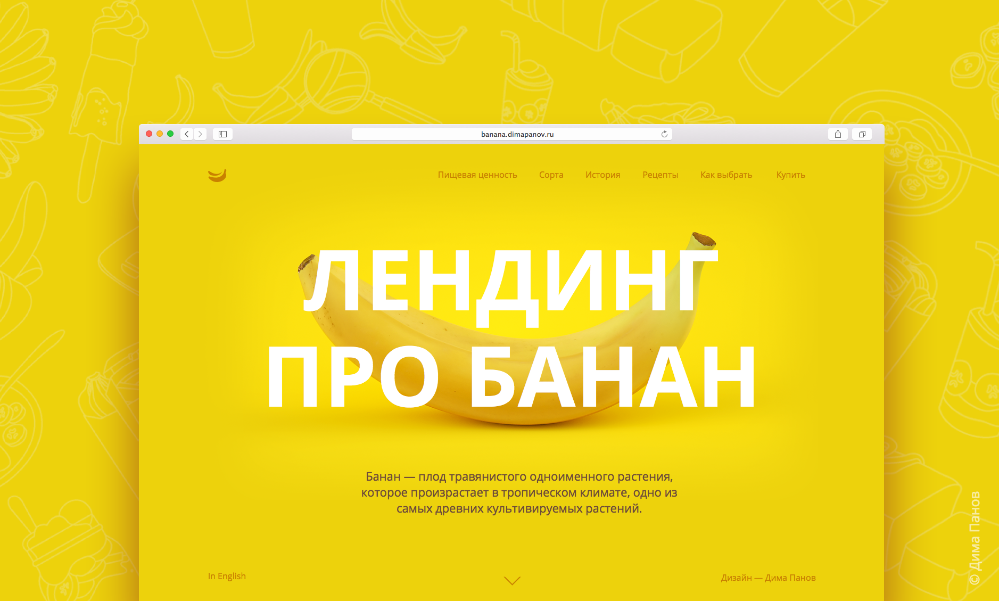
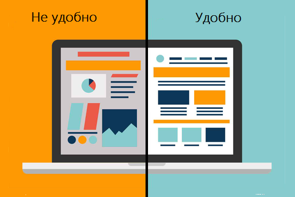
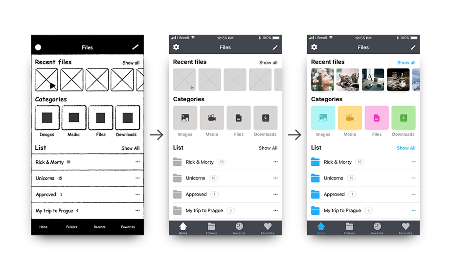
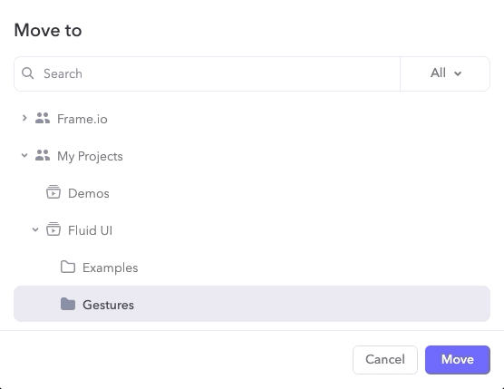

**UX дизайн** **(User experience design)** — это комплексный подход к взаимодействию пользователя с цифровым продуктом. Цель UX дизайна — создание максимально удобных в функционале и простых для восприятия сайтов, мобильных приложений или программ.

**UI дизайн (User interface design)** — более узкое понятие, включающее набор графических инструментов (кнопки, слайдеры, меню и пр.)

**Интерфейс** -неотъемлемая часть любого продукта. Это объект, среда, набор инструментов, с помощью которых пользователь взаимодействует с готовым продуктом. Например, кнопки, галочки, текстовые поля, подсказки, переключатели на сайте. По сути, интерфейс ведет за собой пользователя.

**Целевая страница или Лендинг (Landing page)** -веб-страница, основной задачей которой является сбор контактных данных целевой аудитории. Используется для усиления эффективности рекламы, увеличения аудитории. Целевая страница обычно содержит информацию о товаре или услуге. Целивую страницу разделяют на несколько типов и видов.\
*Литература: [рус](https://tilda.education/courses/landing-page/understanding-main-principles/)*

**Юзабилити (Usability)**  - удобство и простота использования, степень удобства использования, способность продукта быть привлекательным для пользователя, использования системы сводится не только к тому, насколько её легко эксплуатировать, но и учитывая личные цели пользователя, его эмоции и ощущения, связанные с восприятием системы, а также удовлетворённость работой.\
*литература: [рус](https://vc.ru/design/144835-10-pravil-yuzabiliti-razbiraemsya-na-primerah), [анг](https://www.interaction-design.org/literature/topics/usability#:~:text=%E2%80%9CUsability%E2%80%9D%20refers%20to%20the%20ease,discipline%20of%20user%20experience%20design.&text=It%20should%20be%20easy%20for,first%20contact%20with%20the%20website.)*

**Прототипирование** — это создание схемы или каркаса интерфейса приложения. Прототипы позволяют быстро реализовать базовую продукта для анализа работы системы.

Можно выделить 3 стадии или типа прототипирования 

* **Wireframe -** Каркас или черновой набросок, обычно на бумаге в черно белом цвете. Позволяет сосредоточиться на формирование доступных функциях, приоритетах информации и функциях, правилах отображения информации.
* **Low-fidelity prototype -** Прототип малой детализации. Компьютерное визуальное представление цифрового продукта, мало похожее на окончательный дизайн. Он может принимать самые разные формы, от простых черно-белых эскизов до красочных набросков макета. 
* **High-fidelity prototype** - Прототип высокой детализации. Высококачественный прототип имеет более близкое сходство с конечным продуктом. Обычно он гораздо более подробный и, самое главное, отвечает на большее количество вопросов. 

*Литирература*: [анг](https://medium.com/7ninjas/low-fidelity-vs-high-fidelity-prototypes-903a7befaa5a), [рус](https://dou.ua/lenta/articles/prototyping-for-managers/)*

**Фрейм (Frame)** - Рамка или контейнер групп - элемент графического интерфейса пользователя, который является контейнером для других объектов. Очень схож с окном по своим свойствам, но отличается от него тем, что не может находиться внутри аналогичного контейнера. Разработчики программного обеспечения используют подобные виджеты для группировки компонентов в окне.

**Адаптивный дизайн (Adaptive design)** - это набор макетов, разработанных специально для разных устройств. Он определяет тип используемого устройства и отображает макет, предназначенный для него. Это не означает, что это другой веб-сайт — это означает, что вы увидите определенную версию веб-сайта, оптимизированную для мобильных устройств, компьютеров или планшетов.

